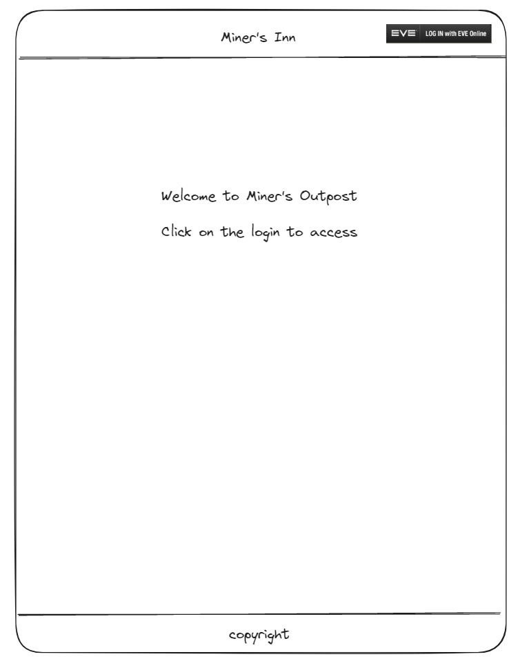
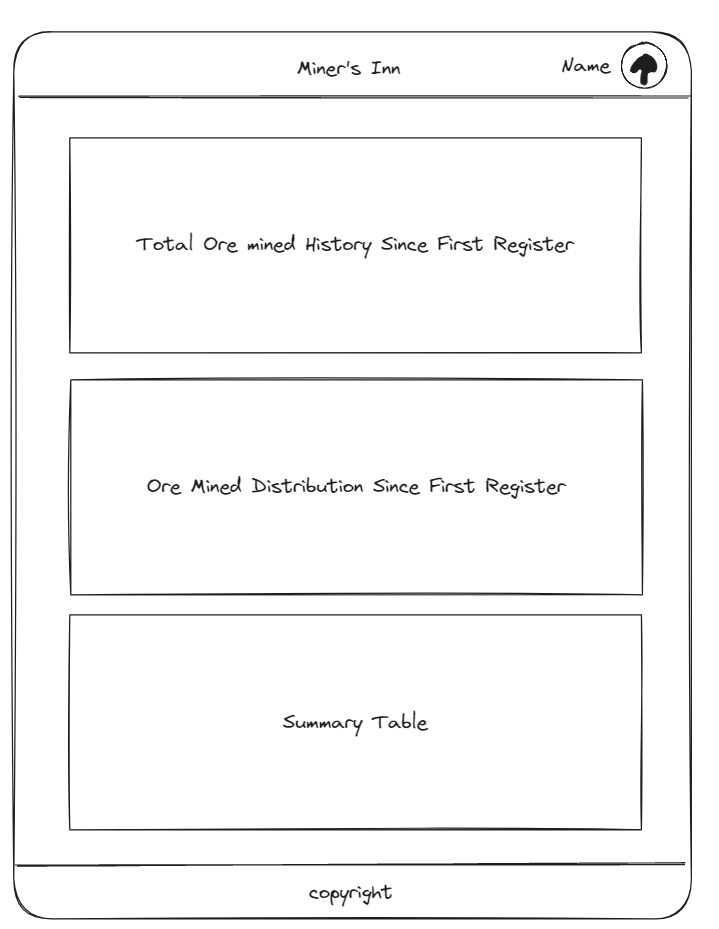
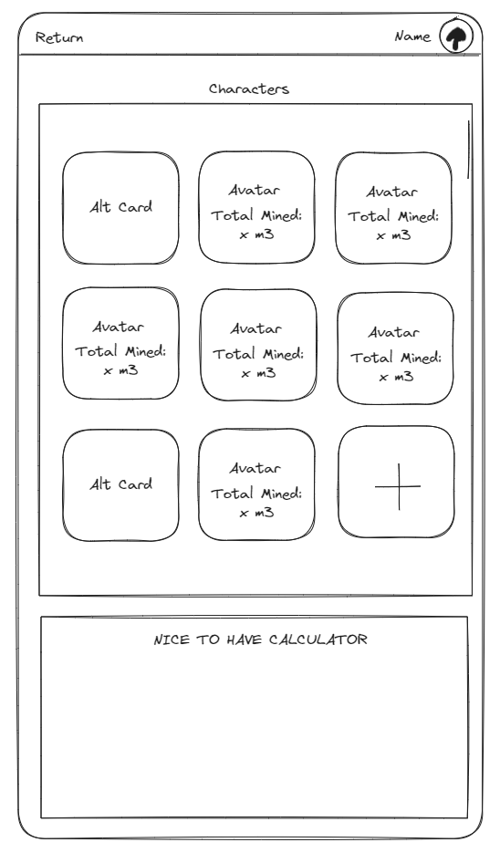
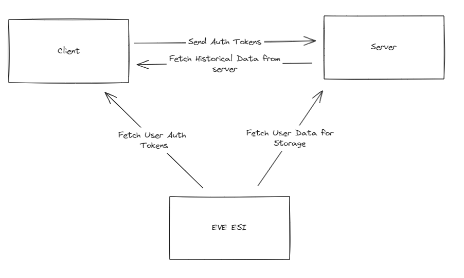
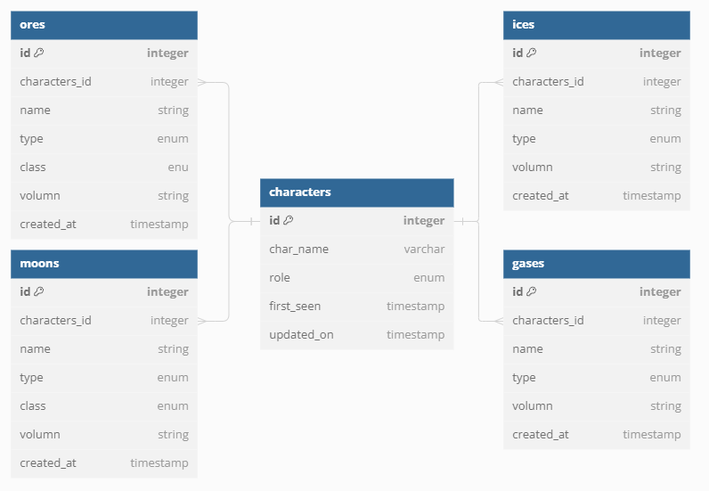

# EVE Online Miner's Hub

Welcome to the Client side of Miner's Hub. For more details on Server side, check out [here](https://github.com/VanK33/miner-hub-server).

## Table of Content

- [Project Description](#project-description)
  - [Motivations](#motivations)
  - [Design Concept](#design-concept)
  - [Tech Stack](#tech-stack)
- [Mock Ups](#mock-ups)
  - [Work Flow](#work-flow)
  - [Database Design](#database-design)
- [Endpoints](#endpoints)
- [Nice to have](#nice-to-have)
- [Challenges](#challenges)

## Project Description

This project serves as a data visualization tool for miners in EVE Online to keep track of their past mining history. The breakdown includes the type of ores mined and when these ores were mined. The client side will be responsible for interacting with potential users, and provide visualization on the mining records

### Motivations

This project is inspired by Feonor's EveMiningFleet web application. However, I realized there are some functionalities that were not incorporated into his project. So, with some knowledge in JavaScript/TypeScript/React/MySQL, I decided to flex my hand against this task and potentially contribute to the EVE community and beloved EVE miners.

### Design Concept

The project is designed with responsiveness in mind. The goal is to ensure users can access the page on different platforms ranging from mobile to desktop. This responsive design will include visual aspects, such as graphing, making sure that the graph is as presentable on mobile as it is on the desktop version. The design language is trying to keep a minimalistic style with mild animations.

### Tech Stack

- React + Next.js
- TypeScript
- Tailwind CSS
- Express
- MySQL
- Chart.js

 

## MOCK UPS

#### Default Page Prior User Authentication and Authorization

  

#### Once Authorized

  

#### Account Management

  

Note: Each user will be linked to various characters, the primary character will always occupied the first slot, followed by other characters.  

Click on the plus sign will send `POST` request of "alt" enum - refer to [Endpoints](#endpoints)

### WORK FLOW

  

Note: Two distinct `POST` requests for enum types - refer to [Endpoints](#endpoints)

### DATABASE DESIGN

  

Note:

`character_owner_hash` currently in character table is not attached to `user` table. This is intented to change/resolve in upcoming patches. See [Challenges](#challenges)

**Character role** [enum]: Primary, Alt  
**Ore class** [enum]: Abyssal, Mercoxit, Complex, Variegated, Coherent, Simple  
**Moon class** [enum]: R64, R32, R16, R8, R4  
**All type** [enum]: ore, moon, ice, gas  

 

## ENDPOINTS

**Cilent-side**

1. Method: `GET`
   - Endpoints：`https://login.eveonline.com/v2/oauth/token`
   - Description: Retrieves access and refresh token from EVE ESI related to the user requested
   - Response : JSON payload containing access and refresh token

**Tententive Server Access Points**

2. Method: `GET`

   - Endpoint: `/api1/:characterID/user-report`
   - Description: Passing characterID, find the userID associated with characterID and retrieves all minable objects from the user with the corresponding userID.
   - Response: JSON payload containing all ore data for the user within the last 12 months.

3. Method: `GET`

   - Endpoint: `/api1/:characterID/user-report/recent`
   - Description: Passing characterID, find the userID associated with characterID and retrieves ores mined within the last 30 days from the user with the corresponding userID.
   - Response: JSON payload containing all ore data from the user for the most recent 30 days.

4. Method: `POST`

   - Endpoint: `/api1/:characterID/primary`
   - Description: Make a new character with role attribute of "primary". This request will mainly be used for landing page
   - Response: JSON payload containing posted character

5. Method: `POST`

   - Endpoint: `/api1/:characterID/alts`
   - Description: Make a new character with role attribute of "alt". This request will mainly be used for alt management page
   - Response: JSON payload containing posted character

6. Method: `PUT`

   - Endpoint: `/api1/:characterID/make-primary`
   - Description: Update role attribute for characterID to "primary", find the userID associated with this characterID, change the characterID with role attribute of "pirmary" to "alt"
   - Response: JSON payload containing updated version of all characters associated with the userID that the characterID linked to

7. Method: `GET`

   - Endpoint: `/api1/:characterID/report`
   - Description: retrieves all minable objects from the character with the corresponding characterID.
   - Response: JSON payload containing all ore data for the character within the last 12 months.

8. Method: `GET`

   - Endpoint: `/api1/:characterID/report/recent`
   - Description: Retrieves ores mined within the last 30 days from the character with the corresponding characterID.
   - Response: JSON payload containing all ore data from the character for the most recent 30 days.

 

## NICE-TO-HAVE

- Adding GET request to pull minable objects by type individually and draw charts for individual results
  - Ore, Ice, Cloud, Moon
- Adding an overall profit per tick depending on the skills from individual characters, the mining ship configs, and type of minable objects (ore, ice, moon, gas)
- Adding alt management page card drag and drop functionality for better customize displaying.
- An additional `PUT` endpoint on server end to handle character transfer
- More ...

 

## KEY LEARNINGS

## CHALLENGES

A list of up to date challenges can be viewed [here](/docs/CHALLENGES.md)

## Acknowledgement

[Return to Top](#eve-online-miners-hub)
