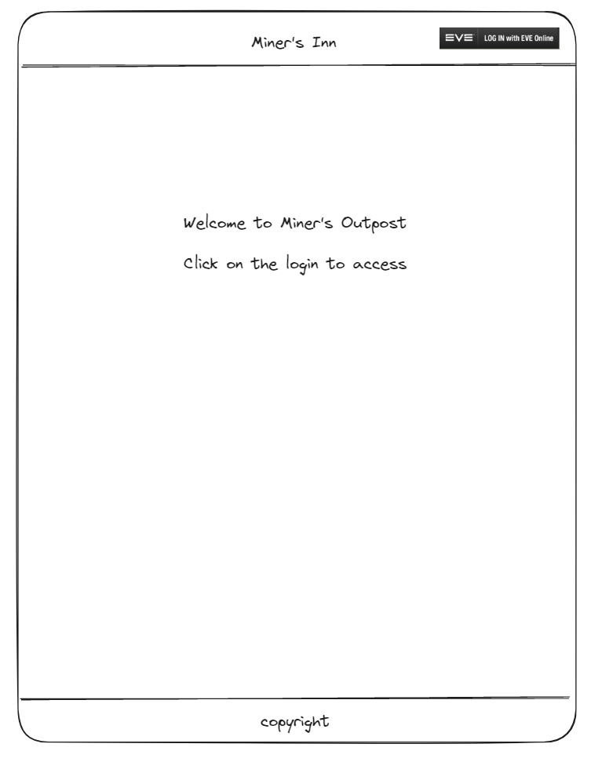
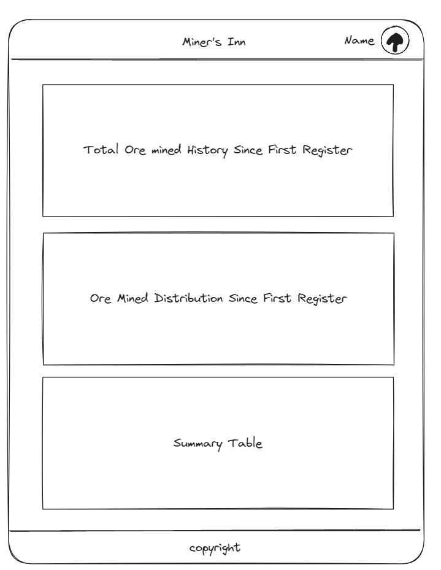
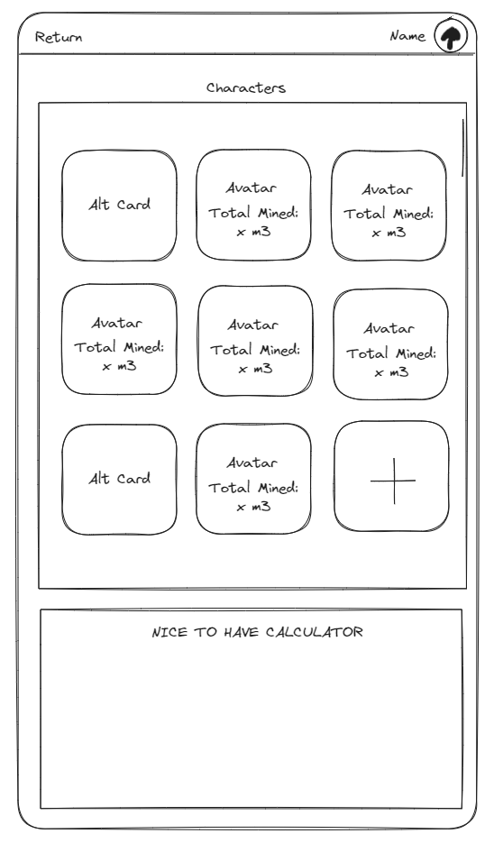
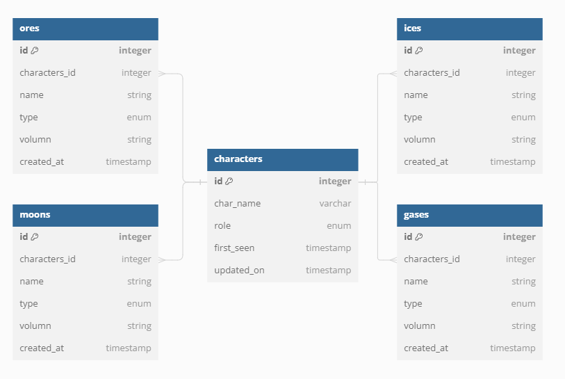

# EVE Online Miner's Hub

## Table of Content

## Project Description

This project serves as a data visualization tool for miners in EVE online to keep track of their past mining history. The breakdown includes the type of ores mined, and when are these ores are mined. Currently the back-end repo is not initiated, and all server-related writeup will be documented in this repo, and ultimately migrate to its own place

### Motivations

This project is inspired by Feonor's EveMiningFleet web application. But I realized there are some of the functionalities that was not incorporated in his project. So with some knowledges in JavaScript/TypeScript/React/MySQL, I decided to flex my hand against this task and potentially contributing to the EVE community, and beloved EVE miners

### Design Concept

The project is designed with responsiveness in mind. The goal is to ensure use can access the page in different platform ranging from mobile to desktop. This responsive design will include visual aspect, such as graphing, making sure that the graph is as presentable in mobile as in desktop version.
The design language is trying to keep a minimalistic style with mild animations

### Teck Stack

- React + Vite
- TypeScript
- Tailwind CSS
- Express
- Postgre SQL
- Chart.js

 

## MOCK UPS

#### Default Page Prior User Authorization and Authentication

  

  

  

### WORK FLOW

  

### DATABASE DESIGN

  

### ENDPOINTS

**Cilent-side**

1. Method: `GET`
   - Endpoints：`https://login.eveonline.com/v2/oauth/token`
   - Description: Retrieves access and refresh token from EVE ESI related to the user requested
   - Response : JSON payload containing access and refresh token

**Tententive Server Access Points**

2. Method: `GET`

   - Endpoints: `/:characterID/report
   - Description: Retrieves all ores from the user with corrosponded characterID
   - Response: JSON payload containing all ore data for the user within the last 12-month

3. Method: `GET`
   - Endpoints: `/:characterID/report/recent
   - Description: Retrieves ores mined within last 30 days from the user with corrosponded characterID
   - Response: JSON payload containing all ore data from the user for the most recent 30-days

### NICE-TO-HAVE

- Adding GET request to pull minable objects by type individually and draw charts for individual results
  - Ore, Ice, Cloud, Moon
- Adding an overall profit per tick depending on the skills from individual characters, the mining ship configs, and type of minable objects (ore, ice, moon, gas)
