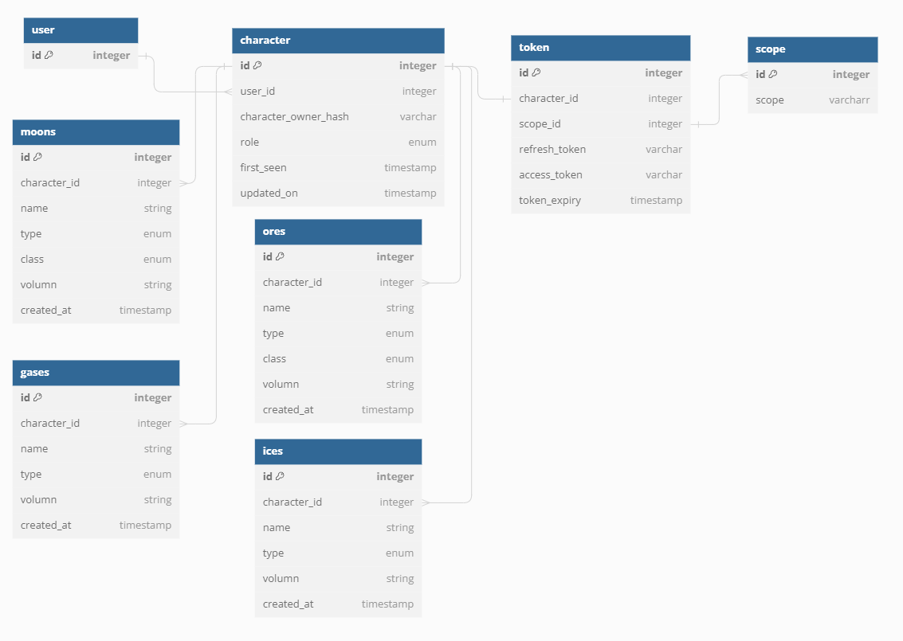

# EVE Online Miner's Hub

## Table of Content

- [Project Description](#project-description)
  - [Motivations](#motivations)
  - [Design Concept](#design-concept)
  - [Tech Stack](#tech-stack)
- [Mock Ups](#mock-ups)
  - [Work Flow](#work-flow)
  - [Database Design](#database-design)
- [Endpoints](#endpoints)
- [Nice to have](#nice-to-have)
- [Challenges](#challenges)

## Project Description

This project serves as a data visualization tool for miners in EVE Online to keep track of their past mining history. The breakdown includes the type of ores mined and when these ores were mined. Currently, the back-end repo is not initiated, and all server-related writeups will be documented in this repo, and ultimately migrate to its own place.

### Motivations

This project is inspired by Feonor's EveMiningFleet web application. However, I realized there are some functionalities that were not incorporated into his project. So, with some knowledge in JavaScript/TypeScript/React/MySQL, I decided to flex my hand against this task and potentially contribute to the EVE community and beloved EVE miners.

### Design Concept

The project is designed with responsiveness in mind. The goal is to ensure users can access the page on different platforms ranging from mobile to desktop. This responsive design will include visual aspects, such as graphing, making sure that the graph is as presentable on mobile as it is on the desktop version. The design language is trying to keep a minimalistic style with mild animations.

### Tech Stack

- React + Vite
- TypeScript
- Tailwind CSS
- Express
- Postgre SQL
- Chart.js

 

## MOCK UPS

#### Default Page Prior User Authentication and Authorization

  

#### Once Authorized

  

#### Account Management

  

### WORK FLOW

  

### DATABASE DESIGN

  

Note:
ore class [enum]: Abyssal, Mercoxit, Complex, Variegated, Coherent, Simple
moon class [enum]: R64, R32, R16, R8, R4
type [enum]: ore, moon, ice, gas

### ENDPOINTS

**Cilent-side**

1. Method: `GET`
   - Endpoints：`https://login.eveonline.com/v2/oauth/token`
   - Description: Retrieves access and refresh token from EVE ESI related to the user requested
   - Response : JSON payload containing access and refresh token

**Tententive Server Access Points**

2. Method: `GET`

   - Endpoints: `/:characterID/report
   - Description: Retrieves all minable objects from the user with the corresponding characterID.
   - Response: JSON payload containing all ore data for the user within the last 12 months.

3. Method: `GET`
   - Endpoints: `/:characterID/report/recent
   - Description: Retrieves ores mined within the last 30 days from the user with the corresponding characterID.
   - Response: JSON payload containing all ore data from the user for the most recent 30 days.

### NICE-TO-HAVE

- Adding GET request to pull minable objects by type individually and draw charts for individual results
  - Ore, Ice, Cloud, Moon
- Adding an overall profit per tick depending on the skills from individual characters, the mining ship configs, and type of minable objects (ore, ice, moon, gas)

### CHALLENGES

Since ESI token will expire after cetain period. How to reliably save, consistently, all historical data without asking user to regularly re-authorize to the site.
